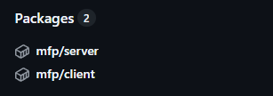
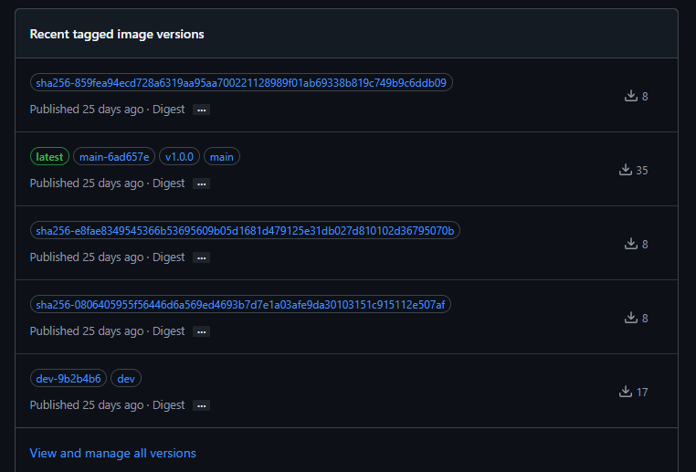
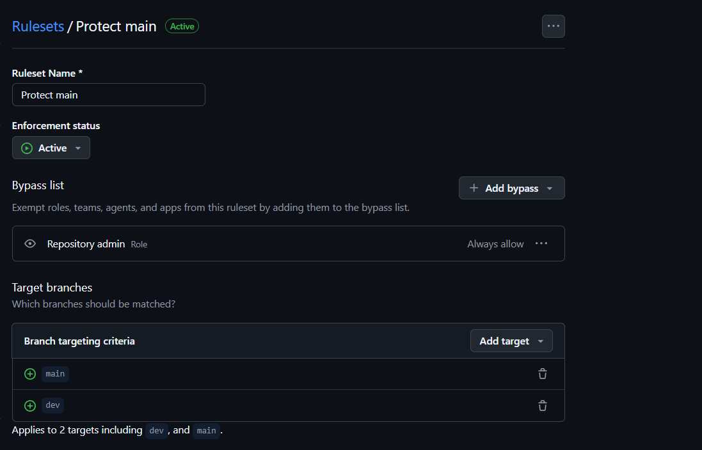
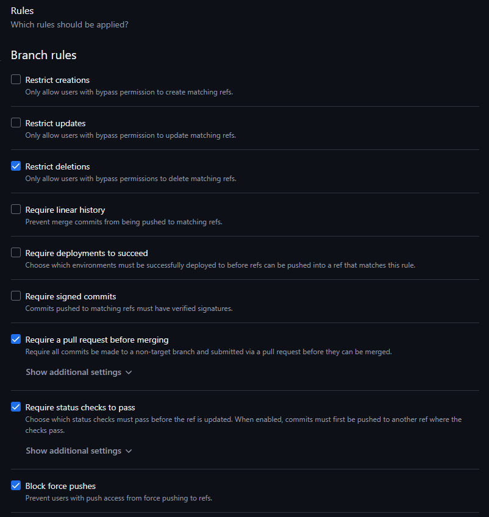
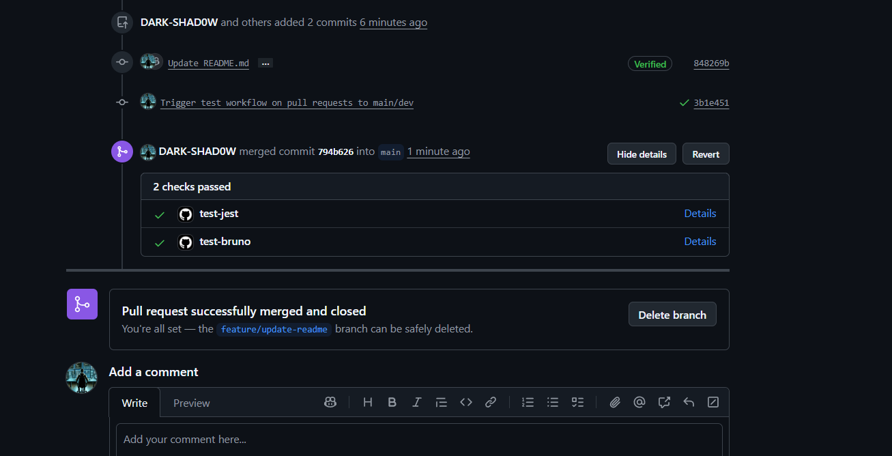
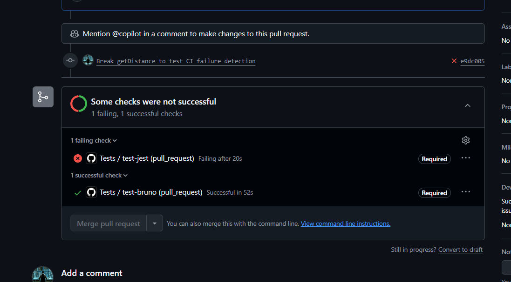

# My Favorite Places App

A modern web application to discover, save, and manage your favorite places. Built with React, Node.js/Express, and PostgreSQL.

## Requirements

- **Docker** & **Docker Compose**
- Node.js 18+ (for local development without Docker)

## Project Architecture

```bash
MFP (My Favorite Places)
├── client/          # React 18 + Vite frontend (Port 5173)
├── server/          # Node.js/Express backend (Port 3000)
├── compose.yml      # Docker Compose for local development
├── compose.prod.yml # Docker Compose for production (pulls from GHCR)
└── compose.test.yml # Docker Compose for CI testing (builds locally)
```

- **Frontend (Client)**: React application with Vite
- **Backend (Server)**: Express.js with TypeORM and PostgreSQL
- **Database**: PostgreSQL 16 Alpine

## Docker Fundamentals

### What is a Dockerfile?
A **Dockerfile** is a blueprint that defines:
- Base image to use
- Dependencies to install
- Files to copy
- Commands to run
- Ports to expose
- Default command to execute

It creates a **Docker image** (a static template/snapshot).

**Example**: `server/Dockerfile` defines how to build the backend image.

### What is Docker Compose?
**Docker Compose** (compose.yml) is an orchestration tool that:
- Defines and runs **multiple containers** as a single application
- Sets up networking between containers
- Manages volumes and environment variables
- Simplifies multi-service deployments with a single command

**Key difference**:
- `Dockerfile` → defines ONE container/image
- `compose.yml` → runs MULTIPLE containers together

---

## Quick Start

### Start the application
```bash
docker compose up
```
Builds and starts all services: PostgreSQL, Express server, React client.

### Start with fresh builds (rebuild images)
```bash
docker compose up --build
```
Use after updating code, dependencies, or Dockerfiles.

### Start in background (detached mode)
```bash
docker compose up -d
```

### Stop all services (keeps volumes)
```bash
docker compose down
```

### Stop and delete everything (including data)
```bash
docker compose down -v
```
⚠️ **Warning**: Removes database volumes.

### Access the application
- **Frontend**: http://localhost:5173
- **Backend API**: http://localhost:3000
- **Database**: localhost:5432

---

## Docker Management

### Docker Images

| Command | Description |
|---|---|
| `docker images`<br>`docker image ls` | List all images |
| `docker build -t my-image-name:1.0 ./server` | Build an image from a Dockerfile |
| `docker tag my-image-name:1.0 my-image-name:latest`<br>`docker tag my-image-name:1.0 username/my-image-name:1.0` | Tag an image |
| `docker rmi image-name:tag`<br>`docker rmi image-id` | Remove a specific image |
| `docker rmi -f image-name:tag` | Remove an image forcefully |
| `docker image prune` | Delete all unused images |
| `docker rmi $(docker images -q)` | Delete all images, including used ones |
| `docker rmi -f $(docker images -q)` | Delete all images forcefully |
| `docker search ubuntu` | Search for an image from Docker Hub |
| `docker pull postgres:16-alpine` | Pull an image from Docker Hub |

### Docker Containers

| Command | Description |
|---|---|
| `docker ps`<br>`docker container ls` | List running containers |
| `docker ps -a`<br>`docker container ls -a` | List all containers, including stopped ones |
| `docker run -d --name my-container -p 8080:80 nginx` | Run a container |
| `docker start container-name`<br>`docker start container-id` | Start a stopped container |
| `docker stop container-name` | Stop a running container |
| `docker kill container-name` | Kill a container forcefully |
| `docker rm container-name` | Remove a stopped container |
| `docker rm -f container-name` | Remove a running container forcefully |
| `docker container prune` | Delete all stopped containers |
| `docker rm $(docker ps -aq)` | Delete all containers, stopped and running |
| `docker rm -f $(docker ps -aq)` | Delete all containers forcefully |
| `docker logs container-name`<br>`docker logs -f container-name`<br>`docker logs --tail 100 container-name` | View container logs |
| `docker exec -it container-name bash`<br>`docker exec -it container-name sh` | Execute a command in a running container |
| `docker inspect container-name` | Inspect container details |

### Docker Networks

| Command | Description |
|---|---|
| `docker network ls` | List Docker networks |
| `docker network create my-network`<br>`docker network create --driver bridge my-network` | Create a network |
| `docker network connect my-network container-name` | Connect a container to a network |
| `docker network disconnect my-network container-name` | Disconnect a container from a network |
| `docker network rm my-network` | Remove a network |
| `docker network prune` | Remove all unused networks |
| `docker network inspect my-network` | Inspect a network and its connected containers |

### Docker Volumes

| Command | Description |
|---|---|
| `docker volume ls` | List Docker volumes |
| `docker volume create my-volume` | Create a volume |
| `docker volume inspect my-volume` | Inspect a volume |
| `docker volume rm my-volume` | Remove a volume |
| `docker volume prune` | Remove all unused volumes |
| `docker volume rm $(docker volume ls -q)` | Remove all volumes, including used ones |
| `docker run -d -v my-volume:/data --name my-container nginx` | Mount a volume when running a container |

### System Cleanup

| Command | Description |
|---|---|
| `docker system df` | Show Docker disk usage |
| `docker system prune` | Remove all unused data: images, containers, networks, and volumes |
| `docker system prune -a --volumes` | Aggressive cleanup that removes all unused data forcefully |

---

## Practical Examples

### Clean and rebuild everything
```bash
# Stop all services
docker compose down -v

# Remove all dangling images/containers
docker system prune

# Rebuild and start fresh
docker compose up --build
```

### Access the database
```bash
# Option 1: Connect via docker exec
docker exec -it mfp-db-1 psql -U mfp-user -d mfp-db

# Option 2: Use psql from your machine
psql -h localhost -U mfp-user -d mfp-db
```

### Rebuild only the server
```bash
docker compose up --build server
```

### Remove only the database and restart (keep server/client)
```bash
docker volume rm mfp-db-data
docker compose up db
```

### Tag and push images to Docker Hub
```bash
docker tag mfp-server:latest username/mfp-server:1.0
docker push username/mfp-server:1.0
```

---

## Using Production Compose File

The `compose.prod.yml` file pulls pre-built images from GitHub Container Registry (GHCR) instead of building locally.

## CI/CD Pipeline

### Overview

The project implements automated Docker image building and publishing through GitHub Actions workflows. Images are automatically built on code changes and pushed to GitHub Container Registry (GHCR).

### Workflows

Three workflows handle the CI/CD pipeline:

- **`build.client.yml`**: Builds and pushes the React frontend image
- **`build.serveur.yml`**: Builds and pushes the Node.js backend image
- **`test.yml`**: Runs the code-quality gate and backend tests before merge

#### Trigger Conditions

Workflows trigger on:
- `build.client.yml`: push to `main` or `dev` when client files change
- `build.serveur.yml`: push to `main` or `dev` when server files change
- `test.yml`: push and pull request events targeting `main` or `dev`, when client or server files change

The test workflow also watches `compose.test.yml` and the workflow file itself so CI stays in sync with the environment it uses.

#### Image Tagging Strategy

Each build generates multiple tags for flexibility:
- **Branch name tag**: `main` or `dev`
- **Commit SHA tag**: `main-a1b2c3d` or `dev-x9y8z7w` (for version tracking)
- **Latest tag**: Added only on `main` branch
- **Dev tag**: Added only on `dev` branch

#### GHCR Registry Proof

These screenshots show the images published to GitHub Container Registry and the versioned tags generated by the build workflow.




#### Build Pipeline Steps

1. Checkout code from repository
2. Authenticate with GitHub Container Registry
3. Extract and generate image metadata and tags
4. Build Docker image and push to GHCR
5. Generate security attestation (proves GitHub Actions built the image)

### Code Quality: Linting and Formatting

The `test.yml` workflow is the quality gate for pull requests and pushes. It is split by scope so client changes and server changes are validated independently.

#### Lint Jobs

- **`lint-client`**: runs only when `client/**` changes
- **`lint-server`**: runs only when `server/**` changes

Each lint job does two checks:
- TypeScript type checking with `npx tsc --noEmit`
- Prettier formatting validation on source files only

Client formatting scope:
- `client/src/**/*.{ts,tsx,js,jsx,css}`
- `client/vite.config.ts`

Server formatting scope:
- `server/src/**/*.{ts,tsx,js,jsx}`
- `server/jest.config.js`

#### Behavior

- If lint fails, the backend tests do not start
- If only client files change, the client lint job runs and backend tests are skipped
- If server files change, the server lint job runs first, then Jest and Bruno run after it passes

#### Local Checks

```bash
cd client
npx prettier@3 --check "src/**/*.{ts,tsx,js,jsx,css}" "vite.config.ts"
npx tsc --noEmit
```

```bash
cd server
npx prettier@3 --check "src/**/*.{ts,tsx,js,jsx}" "jest.config.js"
npx tsc --noEmit
```

### Production Deployment

The `compose.prod.yml` file pulls pre-built images from GHCR instead of building locally:

```bash
docker compose -f compose.prod.yml up
```

This separates development (local builds) from production (pre-built images):

| Scenario | Command | What Happens |
|----------|---------|--------------|
| **Local Development** | `docker compose up --build` | Builds images locally from Dockerfile |
| **Production** | `docker compose -f compose.prod.yml up` | Pulls pre-built images from GHCR |
| **Dev Branch Images** | Edit image tags to `:dev` in compose.prod.yml | Pulls development branch images |

### Update Images in Production

```bash
# Pull latest images from registry
docker compose -f compose.prod.yml pull

# Restart services with updated images
docker compose -f compose.prod.yml up -d
```

### Fixing Docker Hub Rate Limiting

#### Problem

Docker Hub limits unauthenticated image pulls to 25 requests per 6 hours per IP address. When GitHub Actions tries to pull base images (e.g., `node:20-alpine`) during builds, it hits this rate limit error:

```
429 Too Many Requests: too many failed login attempts for username or IP address
```

#### Solution: Docker Hub Authentication

To avoid rate limiting, add Docker Hub credentials to the workflows:

#### Step 1: Create Docker Hub Access Token

1. Go to Docker Hub: https://app.docker.com/settings/personal-access-tokens
2. Click **"Generate new token"**
3. Give it a name (e.g., `github-actions`)
4. Set permissions to **Read, Write, Delete**
5. Copy the token (displayed only once!)

#### Step 2: Add GitHub Secrets

1. Go to your GitHub repo settings: https://github.com/DARK-SHAD0W/MFP/settings/secrets/actions
2. Click **"New repository secret"**
3. Add secret #1:
   - **Name:** `DOCKERHUB_USERNAME`
   - **Value:** Your Docker Hub username
4. Add secret #2:
   - **Name:** `DOCKERHUB_TOKEN`
   - **Value:** Your Docker Hub access token

#### Step 3: Update Workflows

Both workflow files (`build.client.yml` and `build.serveur.yml`) include this step:

```yaml
- name: Log in to Docker Hub
   uses: docker/login-action@v4
  with:
    username: ${{ secrets.DOCKERHUB_USERNAME }}
    password: ${{ secrets.DOCKERHUB_TOKEN }}
```

This step authenticates with Docker Hub BEFORE pulling base images, avoiding the rate limit.

#### Updated CI Flow

1. Checkout code from repository
2. Authenticate with Docker Hub (avoids rate limiting)
3. Authenticate with GitHub Container Registry
4. Read the version number from `VERSION`
5. Extract and generate image metadata and tags
6. Build Docker image and push to GHCR
7. Generate security attestation

The enforced lint gate lives in `test.yml`, where client and server lint jobs run before backend tests.

---

### Semantic Versioning

#### How It Works

The project uses a **VERSION** file at the root to manage semantic versioning:

```
VERSION file: 1.0.0
```

Each build automatically generates images with the following tags:
- `v1.0.0` (semantic version)
- `main-a1b2c3d` (commit SHA on main)
- `latest` (on main branch only)
- `dev` (on dev branch only)

#### Managing Versions

To bump the version:

1. Edit the `VERSION` file:
   ```bash
   # For patch release (bug fix)
   1.0.0 → 1.0.1

   # For minor release (new feature)
   1.0.0 → 1.1.0

   # For major release (breaking change)
   1.0.0 → 2.0.0
   ```

2. Commit the change:
   ```bash
   git add VERSION
   git commit -m "Bump version to 1.1.0"
   git push origin main
   ```

3. The workflow will automatically:
   - Build new images
   - Tag them with `v1.1.0`
   - Push to GHCR

#### Image Tags Example

For version `1.0.0`:
- `ghcr.io/owner/mfp/client:v1.0.0` ← Semantic version tag
- `ghcr.io/owner/mfp/client:main-a1b2c3d` ← Commit SHA
- `ghcr.io/owner/mfp/client:latest` ← Latest on main
- `ghcr.io/owner/mfp/client:main` ← Branch name

For dev branch with version `1.0.0`:
- `ghcr.io/owner/mfp/client:v1.0.0` ← Semantic version (shared)
- `ghcr.io/owner/mfp/client:dev-x9y8z7w` ← Dev commit SHA
- `ghcr.io/owner/mfp/client:dev` ← Dev branch tag

---

### Testing

A dedicated **test workflow** (`test.yml`) runs automatically for pull requests and pushes targeting `main` and `dev`. It includes scoped lint jobs plus backend validation.

#### CI Flow

1. Detect which part changed (`client` or `server`)
2. Run the matching lint job(s)
3. If server lint passes, run Jest and Bruno
4. Upload Jest coverage and Bruno test artifacts

#### Jest Unit Tests

**Jest** runs unit tests on the server code. It validates pure logic and HTTP endpoints without needing a database.

##### What It Tests

- **Health endpoint**: Verifies `GET /health` returns `200` with `{ status: "ok" }`
- **404 handler**: Verifies unknown routes return `404`
- **getDistance utility**: Validates the Haversine distance calculation (Paris-Lyon, Paris-London, symmetry)

##### CI Pipeline

The Jest job (`test-jest`) runs in the dedicated `test.yml` workflow after the server lint gate:

1. Checkout code
2. Setup Node.js 20
3. Install dependencies (`npm ci`)
4. Run Jest with coverage (`npx jest --coverage`)
5. Upload coverage report as artifact

##### Local Testing

```bash
cd server
npm install
npm test
```

With coverage:

```bash
npm test -- --coverage
```

##### Adding New Tests

Create test files next to the source files with the `.test.ts` extension:

```
server/src/
├── app.ts
├── app.test.ts              # Tests for app.ts
└── utils/
    ├── getDistance.ts
    └── getDistance.test.ts   # Tests for getDistance.ts
```

#### Bruno API Tests

**Bruno** runs end-to-end API tests against a live server instance. It validates the full request/response cycle with a real database.

##### What It Tests

- **Register** (`POST /api/users`): Creates a new user, verifies response structure
- **Login** (`POST /api/users/tokens`): Authenticates user, verifies token generation
- **Get Current User** (`GET /api/users/me`): Validates authenticated user retrieval
- **List Addresses** (`GET /api/addresses`): Validates authenticated address listing

Tests run sequentially (seq 1-4). The Login test saves the JWT token via `bru.setVar("token", ...)` for use in subsequent authenticated requests.

##### CI Pipeline

The Bruno job (`test-bruno`) also waits for the server lint gate and builds the server locally using `compose.test.yml`:

1. Checkout code
2. Build and start server + database (`docker compose -f compose.test.yml up -d --build`)
3. Install Bruno CLI (`npm install -g @usebruno/cli`)
4. Wait for server health check (up to 2 minutes)
5. Run Bruno tests (`bru run`)
6. Upload test results (JSON + HTML) as artifacts

##### Local Testing

```bash
# Start server and database
docker compose up -d db server

# Install Bruno CLI
npm install -g @usebruno/cli

# Run tests
cd server/bruno-tests
bru run
```

##### Adding New Tests

Create `.bru` files in `server/bruno-tests/` with incrementing `seq` numbers:

```
server/bruno-tests/
├── bruno.json                  # Collection config
├── Test Register.bru           # seq: 1
├── Test Login.bru              # seq: 2
├── Test Get Current User.bru   # seq: 3
├── Test List Addresses.bru     # seq: 4
└── Test New Feature.bru        # seq: 5
```

#### Test Compose File

The `compose.test.yml` file is a lightweight compose configuration used exclusively by CI for Bruno tests. Unlike `compose.prod.yml` (which pulls images from GHCR), it builds the server image from source:

| File | Server Image | Services | Purpose |
|------|-------------|----------|---------|
| **compose.yml** | Builds locally | db, server, client | Local development |
| **compose.prod.yml** | Pulls from GHCR | db, server, client | Production deployment |
| **compose.test.yml** | Builds locally | db, server | CI testing (Bruno) |

---

### Branch Protection

The `main` and `dev` branches are protected with GitHub Rulesets to ensure code quality before merging.

#### Protection Setup

- **Require a pull request before merging**: No direct push to `main` or `dev`, all changes must go through a PR
- **Require status checks to pass**: The following types of checks must pass before a PR can be merged:
   - Jest unit tests (job/context will include the `test-jest` job)
   - Bruno API tests (job/context will include the `test-bruno` job)

The lint jobs are part of the same workflow and run automatically before the tests. The required branch checks can stay on the test jobs because the tests cannot run if lint fails.

When configuring branch protection in GitHub, **do not type `test-jest` or `test-bruno` manually**. Instead, open a PR, let CI run, then go to the PR’s **Checks** tab and copy the exact status check context strings shown there (for example, they may appear as `Tests / test-jest` or similar). Use those exact context strings in the branch protection rule. If workflow or job names are renamed and the displayed check names change, update the branch protection rules accordingly; otherwise merges may be blocked even when CI succeeds.

#### Ruleset and Registry Proof

These screenshots show the branch rules and registry setup that support the protected workflow.




#### Example Flow

1. Create a feature branch from `main` or `dev`
2. Make changes and push
3. Open a Pull Request
4. Wait for CI checks to pass (Jest + Bruno)
5. Merge only if all checks are green

#### Example PRs

The screenshots below show the PR states you get while using the protected flow.

##### PR with Passing Tests



This is the expected PR state when CI passes and the branch is allowed to merge.

##### PR with Failing Tests



This is the blocked PR state when one of the required checks fails.